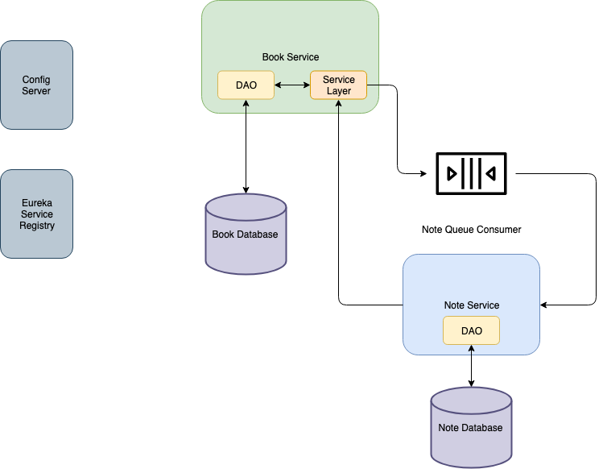

# group-project-book-system

## Book System

The Book System keeps track of books and associated notes. The system consists of the following components:

1. Spring Cloud Config Server
2. Eureka Service Registry
3. Book Service
4. Note Service
5. Note Queue Consumer

### System Design




### General Requirements

1. All system components must get their configuration from the Config Server.
2. All system components must register with Eureka.
3. All web service to web service communcation must be done using Feign clients.
4. All DAO and Service layer components must have unit/integration tests.

## Component Specifications

### Spring Cloud Config Server

1. Run the config server on port 9100.

### Eureka Service Registry

1. Run Eureka on its default port.

### Book Service

The Book Service is a typical Spring Boot REST web service with Controller, DAO, and Service Layer components. It acts as the edge service for the system. Users must use the Book Service for all book and note operations. The Service Layer will use the Note Queue to update the Note Service; it will directly contact the Note Service (using a Feign client) when retrieving Notes.

It requires support for:

1. Web starter
2. JDBC
3. MySQL
4. Config Server
5. Eureka
6. Feign

##### Design Considerations

1. Consider using a View Model class to represent a book and its notes.
2. consider using the Service Layer to coordinate the interaction with the DAO and the Note Service/Queue.

##### Port

Run the Book Service on port 4242.

##### REST API

```
Create Book
===========
URI: /books
HTTP Method: POST
RequestBody: Book data (minus ID)
ResponseBody: Book data (plus autogenerated ID)

Get Book
========
URI: /books/{id}
HTTP Method: GET
RequestBody: None
ResponseBody: Book data

Get All Books
=============
URI: /books
HTTP Method: GET
RequestBody: None
ResponseBody: Array of Book data

Update Book
===========
URI: /books/{id}
HTTP Method: PUT
RequestBody: Book data
ResponseBody: None

Delete Book
===========
URI: /books/{id}
HTTP Method: DELETE
RequestBody: None
ResponseBody: None
```

##### Database Schema

```sql
create schema if not exists book;
use book;

create table if not exists book (
	book_id int not null auto_increment primary key,
    title varchar(50) not null,
    author varchar(50) not null
);
```

### Note Service

The Note Service is a typical Spring Boot REST web service with Controller and DAO components.

It requires support for:

1. Web starter
2. JDBC
3. MySQL
4. Config Server
5. Eureka

##### Port

Run the Note Service on port 1984.

##### REST API

```
Create Note
===========
URI: /notes
HTTP Method: POST
RequestBody: Note data (minus ID)
ResponseBody: Note data (plus autogenerate ID)

Get Note
========
URI: /notes/{id}
HTTP Method: GET
RequestBody: None
ResponseBody: Note data

Get Notes by Book
=================
URI: /notes/book/{book_id}
HTTP Method: GET
RequestBody: None
ResponseBody: Array of Book data

Get all Notes
=============
URI: /notes
HTTP Method: GET
RequestBody: None
ResponseBody: Array of Book data

Update Note
=================
URI: /notes/{id}
HTTP Method: PUT
RequestBody: Note data
ResponseBody: None

Delete Note
===========
URI: /notes/{id}
HTTP Method: DELETE
RequestBody: None
ResponseBody: None
```


##### Database Schema

```sql
create schema if not exists note;
use note;

create table if not exists note (
	note_id int not null auto_increment primary key,
    book_id int not null,
    note varchar(255)
);
```

### Note Queue Consumer

This is a typical queue consumer application. The application processes Notes from the queue and sends them to either the Update or Create endpoints of the Note web service.

It requires support for:

1. RabbitMQ
2. Feign
3. Jackson Converter Libraries

##### Design Considerations

1. Consider having the service inspect the incoming Notes for the presence of a note_id in order to determine if Update or Create is appropriate.
2. The Note class must be included in the Book Service, the Note Queue, and the Note Service.
3. This service must use the Feign client to communicate with the Note Service.

##### Queue Configuration

1. Topic Exchange Name: ```note-exchange```
2. Queue Name: ```note-queue```
3. Routing Key: ```note.#```
